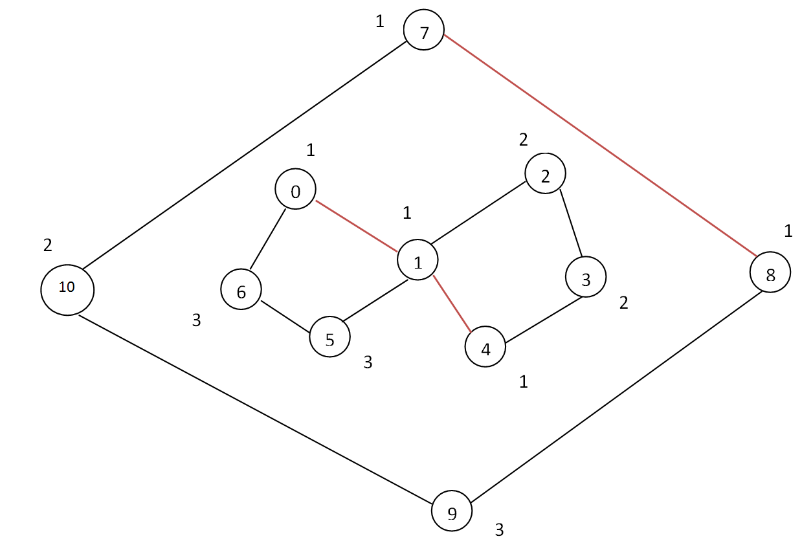

# Tấn Công Thành Trì
>
> Level 4

Sau một thời gian dài dưỡng thương ở Hán Trung, Khổng Minh đã bình phục và quyết định tấn công vào vào biên giới nước Ngụy để hoàn thành chí nguyện Bắc phạt của mình.
Canh giữ biên giới của Ngụy là Tư Mã Ý, một viên tướng cực kỳ khôn ngoan và mưu trí.
Trước đó, Tư Mã Ý đã cho xây dựng một hệ thống phòng thủ gồm các thành trì (tòa thành), giữa các thành trì y lại cho đắp các thành lũy (bức tường) liên kết với các thành trì  nhau để bảo vệ cho các đội quân đồn trú bên trong.
Vì thế, trận địa phòng ngự của Ngụy quân rất vững chắc, tầng tầng lớp lớp.

Khổng Minh là một nhà quân sự tài ba, y đã vạch ra kế hoạch hoàn mỹ như sau:

Bước 1: Dùng máy bắn đá phá vỡ một số thành lũy liên kết giữa các thành trì của quân Ngụy, sao cho không có đội quân nào của Ngụy được bảo vệ kín bởi hệ thống thành lũy.

Bước 2: Dùng nhân tâm kế để đánh giáp lá cà với Ngụy quân.

Theo thông tin thám báo, Khổng Minh biết rằng Tư Mã Ý đã chuẩn bị rất nhiều các máy bắn đá để bảo vệ các thành trì.
Theo tính toán của Khổng Minh, để đảm bảo phá được một thành lũy thì cần sử dụng số máy bắn đá bằng với tổng số máy bắn đá ở hai đầu thành lũy đó.

Ví dụ: nếu thành trì `A` có 5 máy bắn đá, thành trì `B` có 3 máy bắn đá, để phá được thành lũy nối thành trì `A` và thành trì `B`, đội quân của Khổng Minh cần sử dụng ít nhất `5+3=8` máy bắn đá.



Hình vẽ minh họa cho một hệ thống các thành trì và thành lũy của quân Ngụy.
Muốn phá các thành lũy liên kết giữa ba cặp thành trì (7, 8), (0, 1) và (1, 4) thì số lượng máy bắn đá ít nhất phải dùng là (1+1)+( (1+1)+(1 + 1) = 6 cái.
Khi đó, không còn đội quân nào của Ngụy được bao bọc kín bởi thành lũy nữa, và khi đó đội quân của Khổng Minh sẽ sẵn sàng vào tấn công giáp lá cà.

Hãy giúp Khổng Minh tính toán xem cần sử dụng ít nhất bao nhiêu máy bắn đá để thực hiện được bước 1 của chiến dịch trong chí nguyện Bắc phạt của mình.

## Input

- Dòng đầu tiên là số lượng bộ test `T`
- Mỗi test gồm được biễu diễn như sau:
  - Dòng đầu tiên gồm số nguyên `M` (`2 <= M <= 100`)  là số thành trì của quân Ngụy, các thành trì được đánh số từ 0 đến M-1.
  - Tiếp theo là mô tả `M` thành trì, mỗi thành trì được mô tả trên 2 dòng: dòng thứ nhất gồm 3 số nguyên dương `i` (`0 <= i <= M-1`), `u_i` (`1 <= u_i <= 50`), `c_i` (`1 <= c_i <= M-1`) lần lượt là số hiệu của thành trì, số máy bắn đá của quân Ngụy có trong thành trì và số lượng thành lũy liên kết tới các thành trì khác.
    Dòng thứ hai gồm `c_i` số, thể hiện các thành trì có thành lũy liên kết tới thành trì `i`.

```
3
3
0 1 2
1 2
1 2 2
0 2
2 3 2
0 1
7
0 1 2
2 3
1 2 2
3 4
2 3 2
0 5
3 1 4
0 1 5 6
4 2 2
1 6
5 3 2
2 3
6 1 2
3 4
4
0 1 2
1 2
1 8 2
0 3
2 16 2
0 3
3 12 2
1 2
```

## Output

Với mỗi test, in ra tổng số máy bắn đá ít nhất cần sử dụng để thực hiện bước 1 của chiến dịch.

```
3
4
9
```

