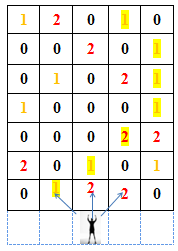

# Qua Cầu

Có 1 số cây cầu làm bằng gỗ.
Trải qua 1 thời gian, những cây cầu trở nên hư hại và xuất hiện những lỗ thủng trên đó.
Được biết những cây cầu đó luôn có độ rộng `M = 5` (bước đi).

## Công việc:

Có 1 người luôn luôn đứng giữa ở 1 phía của cây cầu.
Nhiệm vụ của bạn là phải đưa người đó qua được cầu với số đồng xu nhặt được là lớn nhất.
Được biết trên cầu có 1 số đồng xu bị đánh rơi và người đó chỉ có thể đi thẳng, đi chéo trái hoặc đi chéo phải.
Ngoài ra người đó có mang 1 tấm ván.
Nó có thể vá được 1 lỗ thủng trên cầu giúp người đó có thể đi qua được.

Lưu ý : không có nhiều hơn 1 đồng xu tại 1 địa điểm.



## Input

Dòng đầu tiên là số lượng trường hợp thử nghiệm.

Dòng thứ 2 chiều dài của cây cầu (`N`).

`N` dòng tiếp theo mô tả cây cầu theo ma trận 2 chiều.
Trong đó: `0` là có thể đi được, `1` là có đồng xu (có thể đi được) và `2` là lỗ thủng.

```
3
7
1 2 0 1 0
0 0 2 0 1
0 1 0 2 1
1 0 0 0 1
0 0 0 2 2
2 0 1 0 1
0 1 2 2 0
10
2 2 2 2 0
1 2 0 0 2
0 2 0 0 0
2 2 0 2 2
0 2 2 2 0
0 0 0 0 0
1 0 0 0 2
0 0 0 0 0
2 2 0 2 1
0 2 2 2 0
9
0 2 1 1 2
0 2 2 2 2
2 2 2 1 0
0 0 2 0 2
0 2 2 1 0
1 0 2 2 2
2 2 0 2 0
2 2 2 0 2
0 0 2 0 0
```

## Output

In theo định dạng  `#test_case` và số đồng xu nhiều nhất có thể khi qua đươc cầu.

Nếu không thể qua cầu in ra `-1`.

```
#1 6
#2 -1
#3 0
```