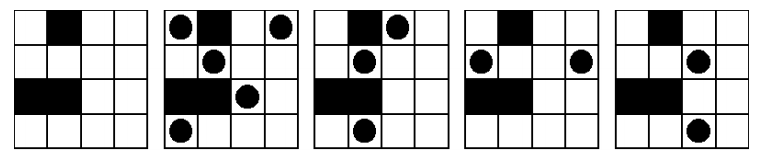

# Chess rook

In chess, the rook is a piece that can move any number of squares vertically or horizontally.

In this problem we will consider small chess boards (at most 4 ×4) that can also contain walls through which rooks cannot move.

The goal is to place as many rooks on a board as possible so that no two can capture each other.

A configuration of rooks is legal provided that no two rooks are on the same horizontal row or vertical column unless there is at least one wall separating them.

The following image shows five pictures of the same board. The first picture is the empty board, the second and third pictures show legal configurations, and the fourth and fifth pictures show illegal configurations.

For this board, the maximum number of rooks in a legal configuration is 5; the second picture shows one way to do it, but there are several other ways.



Your task is to write a program that, given a description of a board, calculates the maximum number of rooks that can be placed on the board in a legal configuration.

## Input

First line of input is number of test cases. Each test case contains a board description.

Each board description begins with a line containing a positive integer N that is the size of the board; N will be at most 4.

The next N lines each describe one row of the board, with a ‘.’ indicating an open space and an uppercase ‘X’ indicating a wall. There are no spaces in the input file.

```
5
4
.X..
....
XX..
....
2
XX
.X
3
.X.
X.X
.X.
3
...
.XX
.XX
4
....
....
....
....
```


## Output

For each test case, output one line containing the maximum number of rooks that can be placed on the board in a legal configuration.

Note that first output line of each test case should be Case #tn, where tn is the test case number.

```
Case #1
5
Case #2
1
Case #3
5
Case #4
2
Case #5
4
```