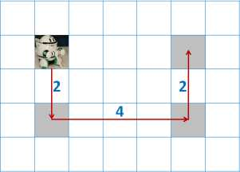

# Cleaning Robot
>
> Level 4
>
> Time limit: 1s (C/C++), 2s (Java)
>
> Submit limit: 10 times


We have to plan a path for a cleaning robot to clean a rectangular room floor of size `NxM`.
The room floor paved with square tiles whose size fits the cleaning robot `(1 x 1)`.
There are **clean tile** and **dirty tiles**, and the robot can change a dirty tile to a clean tile by visiting the tile.
Also there may be some obstacles (furniture) whose size fits a tile in the room.
If there is an **obstacle** on a tile, the robot cannot visit it.
The robot moves to an adjacent tile with one move.
The tile onto which the robot moves must be one of four tiles (i.e. east, west, north or south) adjacent to the tile where the robot is present.
The robot may visit a tile **twice or more**.

Your task is to write a program which computes the minimum number of moves for the robot to change all dirty tiles to clean tiles, if ever possible.

## Example:



The following is a room of size 5x7, with 3 dirty tiles, and 0 furniture.
The answer for this case is 8.

## Input

The input consists of multiple maps, the first line is the number of test case `T` (`T < = 50`)

Each test case begins with `N` and `M` representing the size of the room. (`5 <= N, M <= 100`)

The next `N` line representing the arrangement of the room with following describe:

- `0`: a clean tile
- `1`: a dirty tile
- `2`: a piece of furniture (obstacle)
- `3`: the robot (initial position)

In the map the number of dirty tiles does not exceed 10 and there is only one robot.

```
5
5 7
0 0 0 0 0 0 0
0 3 0 0 0 1 0
0 0 0 0 0 0 0
0 1 0 0 0 1 0
0 0 0 0 0 0 0
5 15
0 0 0 0 2 0 2 0 0 0 0 1 2 0 1
0 0 0 1 0 2 0 2 2 0 1 2 0 0 0
2 1 0 2 0 1 0 2 0 0 0 0 0 0 0
0 0 0 1 0 2 0 0 1 2 0 0 2 0 0
0 2 1 0 2 0 0 0 0 0 3 0 0 0 0
...............
```

## Output

Print each test case on two lines, the first line of each test case is `Case #x`, where `x` is the test case number.
The next line is the minimum number of moves for the robot to change all dirty tiles to clean tiles.
If the map includes dirty tiles which the robot cannot reach, your program should output `-1`.

```
Case #1
8
Case #2
38
Case #3
37
Case #4
-1
Case #5
49
```