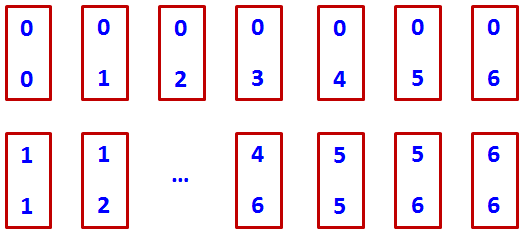
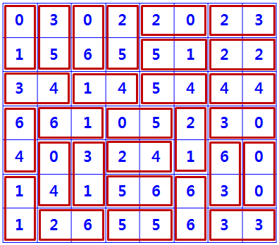

# Cover rectangle with dominos
>
> Level 4

You are given `28` different types of domino, each domino has size of `1x2` with 2 numbers on it as follow



And a board of size `7x8`, your task is cover the board with above dominos such that a domino can only be placed on two adjacent squares on board if the numbers of the squares and of domino are equal.

How many different way to cover the board?

For example if the board are given as below, there are 18 way to cover it, one of them is as below.



## Input

The first line is the number of test case `T` (`T < = 50`).

Each test case will be given on `7` lines, each line have `8` numbers separate by a space is the board for the test case.
It have a empty line between 2 test cases.

```
5
6 1 6 5 3 2 5 0
6 6 0 1 6 0 4 4
2 2 3 6 5 5 1 5
1 2 0 4 4 3 4 2
5 2 1 1 4 1 3 0
3 3 0 2 3 5 2 6
1 3 4 6 4 5 0 0

6 6 6 0 1 4 6 3
2 5 3 3 3 5 5 4
0 0 4 3 3 1 2 4
4 4 2 0 5 5 3 0
0 1 2 2 6 1 2 1
4 6 2 6 5 6 0 4
5 0 5 1 1 1 2 3

2 4 0 2 6 6 4 1
4 5 6 0 3 5 5 6
0 1 6 3 4 3 3 2
0 3 1 1 5 1 3 1
2 5 0 0 6 2 3 3
4 0 6 4 5 0 5 5
2 1 4 4 2 2 6 1

0 5 4 4 2 5 6 2
3 5 1 1 1 0 4 1
3 1 5 1 4 3 1 6
2 0 6 4 5 5 5 6
3 3 3 0 2 3 2 1
0 0 6 0 6 3 4 5
4 2 6 6 0 4 2 2

3 0 6 5 6 4 1 0
3 5 1 3 1 1 0 2
4 4 5 4 3 3 3 2
5 5 1 4 5 1 6 0
5 0 2 2 2 1 6 3
3 4 0 0 6 6 2 5
1 6 4 2 0 4 6 2
```

## Output

Print each test case on one line, the first is `#x`, where `x` is the test case number, separate by a space and the numbers of different way to cover the board.

```
#1 32
#2 24
#3 40
#4 16
#5 20
```