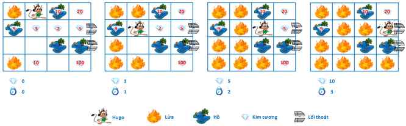

# Hugo
>
> Level 4

Có thử thách dành cho Hugo như sau: Hugo được thả vào 1 khu rừng có rất nhiều kim cương, tuy nhiên đồng thời lúc đó có các đám cháy xuất hiện. Các đám cháy này sẽ lây lan ra các khu vực lân cận theo bốn hướng sau 1 giờ. Tuy nhiên trong khu rừng có một số hồ nhỏ, và lửa không thể cháy lan trên hồ.

Thời gian để Hugo di chuyển giữa các khu đất là 1 giờ, qua khu hồ là 2 giờ. Hãy giúp Hugo thoát khỏi khu rừng cùng với số lượng kim cương lớn nhất có thể và đảm bảo Hugo không bị lửa thiêu.

Lưu ý khu rừng chỉ tồn tại một số lượng nhất định lối thoát, tại danh giới của khu rừng, và Hugo không bao giờ quay lại khu vực mình đã đi qua.



## Input

Dòng đầu là số lượng test case T (T <= 50).

Dòng đầu của mỗi test case là 4 số N, M, SR, SC tương ứng là số hàng, số cột của khu rừng và tọa độ hàng, cột mà Hugo đang đứng. ( 4 <= N, M <= 15).

3 dòng tiếp theo, bắt đầu của mỗi dòng tương ứng là số lượng K các đám cháy hiện có, các hồ và các lối thoát, 2K số tiếp theo trên dòng là tọa độ tương ứng. N dòng tiếp theo sẽ là bản đồ mô tả số lượng kim cương D tại mỗi khu vực trong khu rừng. (0 <= D <= 1000)

```
5                   <- Số lượng test case
4 4 1 2             <- Test case 1, khu rừng có kích thước 4x4, Hugo đang ở ô (1, 2)
2 1 1 4 1           <- 2 Khu vực bắt đầu cháy ở (1, 1) và (4, 1)
4 1 3 2 1 3 3 3 4   <- 4 Khu vực là hồ ở (1, 3), (2, 1), (3, 3) và (3, 4)
2 2 4 3 4           <- 2 lối thoát ở ô (2, 4) và (3, 4)
0 0 10 20           <- Số lượng kim cương hàng 1
9 3 2 5             <- Số lượng kim cương hàng 2
0 0 0 0             <- Số lượng kim cương hàng 3
0 10 0 100          <- Số lượng kim cương hàng 4
...
```

## Output

In mỗi test case trên 2 dòng, dòng đầu tiên là "Case #x", với x là số thứ tự của test case.

Dòng tiếp theo là số lượng kim cương lớn nhất mà Hugo có thể thu được, nếu Hugo không thể thoát ra khỏi khu rừng, in ra -1.

```
Case #1
10  <- Số lượng kim cương lớn nhất mà Hugo có thể thu được
Case #2
45
Case #3
250
Case #4
643
Case #5
328
```