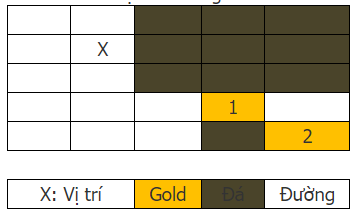
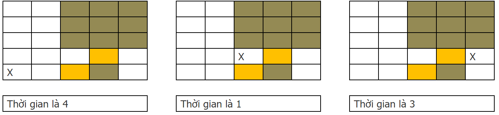

# Hugo Đào Vàng 2
> Level: 4

Sau khi ăn trộm được mật của chị ong nâu và say sưa thưởng thức mật ngọt say đắm thì bất ngờ Hugo bị chị ong nâu phát hiện.
Mặc dù đã thành khẩn nhận lỗi và xin lỗi chị ong nâu nhưng do đã đánh chén gần hết số mật đã ăn chộm nên chị ong nâu vẫn bắt Hugo phải bồi thường số mật đó.
Hugo thì làm sao có thể kiếm mật được vì vậy Hugo phải đi đào vàng kiếm tiền để có tiền mua mật trả cho chị ong nâu.

Một cách tình cờ Hugo có được bản đồ của một khu vực chứa vàng, bản đồ được vẽ dựa trên một ma trận `NxN`.
Trong ma trận có các điểm chứa vàng có thể khai thác (Tối đa 4 điểm).
Hàng ngày Hugo sẽ phải đi tới mỏ vàng để khai thác và cuối ngày sẽ phải mang vàng trở về.
Để tiết kiệm chi phí và thời gian, Hugo quyết định cắm trại trên gần mỏ vàng để tiện khai thác vàng.
Hugo không thể di chuyển qua khu vực đá và không thể cắm trại trên đá, đồng thời Hugo cũng không thể cắm trại tại khu vực mỏ vàng, thời gian để Hugo di chuyển qua mỗi ô là 1 giờ.

Hãy giúp Hugo tìm địa điểm tối ưu để đi khai thác tất cả các mỏ vàng nhanh nhất.

Xem xét ma trận mỏ vàng 5x5 bên dưới:



Có 2 mỏ vàng, nếu Hugo cắm trại tại vị trí X, Hugo sẽ mất 4 giờ để đi tới mỏ vàng thứ 1, và 6 giờ để đi tới mỏ vàng thứ 2, vì vậy thời gian nhỏ nhất để Hugo đi khai thác vàng là 6 giờ, thời gian lớn nhất để đi khai thác của tất cả các mỏ vàng.

Xem xét ví dụ khác:



Thời gian tối ưu với ma trận mỏ vàng trên là 1.

Một mỏ vàng được coi là không thể tiếp cận khi không thể đặt 1 vị trí cắm trại nào để đi khai thác vàng.

## Input

Số trường hợp thử nghiệp `T` `(T ≤ 50)`

Mỗi TC :

- Dòng đầu tiên chứa kích thước ma trận `N` `(N ≤ 20)` và số mỏ vàng `G` `(2 ≤ G ≤ 4)`
- `G` dòng tiếp theo đưa ra vị trí `R` (hàng) & `C` (cột) của mỏ vàng (Chỉ số bắt đầu từ 1)
- `N` dòng tiếp theo là thông tin ma trận: 1 là có đường đi và vị trí mỏ vàng, 0 là đá (không thể đi qua).

```
3
5 2
4 3
3 4
1 1 0 0 0
1 1 0 0 0
1 1 1 1 1
1 1 1 0 1
1 1 1 1 1
8 2
5 6
6 4
1 1 1 1 1 1 0 0
1 1 1 1 1 1 1 0
1 1 0 1 0 1 1 0
1 1 1 1 0 1 1 0
1 1 1 1 1 1 1 0
1 1 1 1 1 1 1 0
0 0 0 0 0 0 0 0
0 0 0 0 0 0 0 0
10 3
8 2
5 3
7 1
0 0 0 1 1 1 1 1 1 0
1 1 1 1 1 1 1 1 1 0
1 0 0 1 0 0 0 0 1 0
1 1 1 1 1 1 1 1 1 1
1 1 1 1 0 1 0 0 1 1
1 1 1 1 0 1 0 0 1 1
1 1 1 1 0 1 0 0 1 1
1 1 1 1 1 1 1 1 1 1
1 1 1 0 0 1 0 0 1 1
1 1 1 1 1 1 1 1 1 1
```
 
## Output

In ra chi phí nhỏ nhất để đi từ trại tới điểm đào vàng xa nhất. Nếu không thể tiếp cận tất cả các mỏ vàng, in ra -1

```
Case #1
1
Case #2
2
Case #3
2
```

## Constraints

- Hugo có thể đi theo 4 hướng (trên/dưới/trái/phải)
- Hugo không thể cắm trại ở vị trí mỏ vàng hoặc
- Hugo có thể đi qua mỏ vàng để đến mỏ vàng
- Hugo cần đặt vị trí trại để tối đa hóa số lượng mỏ vàng có thể khai thác
