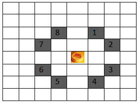
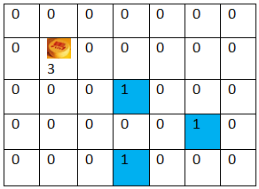

# Quân mã
>
> Level 4

Trong một bàn cờ NxM.

Tìm số lần đi tối thiểu để quân mã ăn hết quân địch.

Quân mã có thể di chuyển xung quanh theo 8 hướng.



## Example : test case 1

Quân mã mất 3 lần di chuyển để ăn hết quân địch . (2,3) -> (3,5) -> (4,3)



## Input

- Dòng đầu tiên là số lương test case.
- Dòng 2 là kích thước của bàn cờ. Tiếp theo là bàn cờ :
	- 3 là vị trí xuất phát của quân mã
	- 1 là vị trí quân địch
	- 0 là vị trí trống.

Quân mã có thể di chuyển trên tất cả các vị trí trên bàn cờ (0,1,3).

```
2
5 7
0 0 0 0 0 0 0
0 3 0 0 0 0 0
0 0 0 1 0 0 0
0 0 0 0 0 1 0
0 0 0 1 0 0 0
10 10
1 0 0 0 0 0 0 0 0 0
0 0 0 0 0 0 0 0 0 0
0 0 0 0 0 0 0 0 0 0
0 0 0 0 0 0 0 1 0 0
0 1 0 0 0 0 0 0 0 0
0 0 0 0 0 0 0 0 0 0
0 0 0 0 0 0 3 0 0 0
0 0 0 0 0 0 0 0 0 0
0 0 0 0 0 0 0 0 0 0
0 0 0 0 0 0 0 0 0 1
```

## Output

In ra số lần di chuyển nhỏ nhất để quân mã ăn hết quân địch.

```
Case #1
3
Case #2
12
```