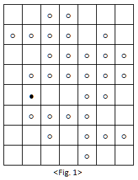
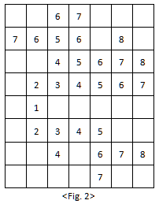

# Laughing Bomb
>
> Level 3

You are busy to promote a newly released film in a movie theater.
The title is "Biochemical Laughing Bomb" which is about terror.
Guerrillas drop a biochemical laughing bomb in the middle of a city.
Once exposed, you have to laugh all your life.
The bomb will contaminate four people around it during 1 second, and another four around each of them during another one second.
However, you won't be contaminated if you are not in the adjacent four directions.
As the below shows the location of the bomb and affected people, and shows contamination process in seconds and you can figure out that the whole city is contaminated in 8 seconds.
In order to protect the city from the epidemic, create a program that figures out when the city will be contaminated by the bomb for the last.




Time limit: 1 second (java: 2 seconds)

## Input

Several test cases can be included in the inputs.
`T`, the number of cases is given in the first row of the inputs.
After that, the test cases as many as `T` (`T <= 30`) are given in a row.
The row and column of the city, `N` and `M` are given by being separated with a blank on the first row of each test case. (`1 <= N, M <= 100`)
The status within city is given by being separated with a blank from the second row to `N` number rows.
`1` means people exist and `0` means people do not exist.
The coordinate of the row and column on which the bomb fall is given by being separated with a blank on the last row.

```
2
7 8
0 0 1 1 0 0 0
1 1 1 1 0 1 0
0 0 1 1 1 1 1
0 1 1 1 1 1 1
0 1 0 0 1 1 0
0 1 1 1 1 0 0
0 0 1 0 1 1 1
0 0 0 0 1 0 0
2 5
10 10
1 1 1 1 0 1 1 0 0 0
0 1 1 1 1 1 0 1 1 0
0 0 1 1 0 1 0 1 1 1
0 1 1 1 1 1 0 0 1 1
0 1 0 1 0 1 1 1 1 0
0 0 0 0 0 1 1 0 0 0
1 0 1 0 1 0 1 1 0 0
0 0 1 1 1 1 1 1 1 1
1 0 1 0 0 1 0 1 1 0
1 1 1 0 0 0 0 1 1 1
2 2
```

## Output

Output how long does it take to contaminate al people on the first row of each test case.

```
8
21
```