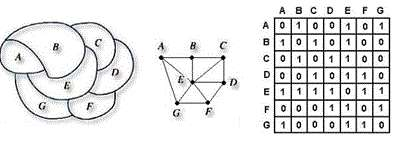

# Painting
> Level 4



The design team at SAMSUNG Electronics considers an innovative design for a new product.

The left figure is the basic diagram and the design team tries to distinguish each area marked by letter of the alphabet with four colors.

When proceeding with this, the design team pursues perfection by researching the combinations of all colors and chooses one of them.

However, they have trouble because they do not know the total number of cases of the color combinations.

Due to this difficulty, you convert the basic diagram on the left to the graph in the center and then you solve the problem by converting it to the adjacency matrix on the right.

The number of cases is 264.

What is the method used to solve this?  (Time Limit : 2 seconds)

## Input

The adjacency matrix about a basic diagram is entered.

On the first line, the number of the test cases (1<=T <= 10) is given.

On the first line of each test case, the size of the matrix n (1<=n <= 30, n is the positive number).

From the second line, the values of matrix are entered by being distinguished as one blank or other.

```
3
4
0 0 0 1
0 0 0 1
0 0 0 1
1 1 1 0
5
0 1 1 1 0
1 0 0 1 1
1 0 0 1 0
1 1 1 0 1
0 1 0 1 0
7
0 1 0 0 1 0 1
1 0 1 0 1 0 0
0 1 0 1 1 0 0
0 0 1 0 1 1 0
1 1 1 1 0 1 1
0 0 0 1 1 0 1
1 0 0 0 1 1 0
```

## Output

For each test case, you should print `Case #T` in the first line where `T` means the case number.
In the second line, print out the total number of cases to paint and distinguish them with four colors for each area.

```
Case #1
108
Case #2
96
Case #3
264
```