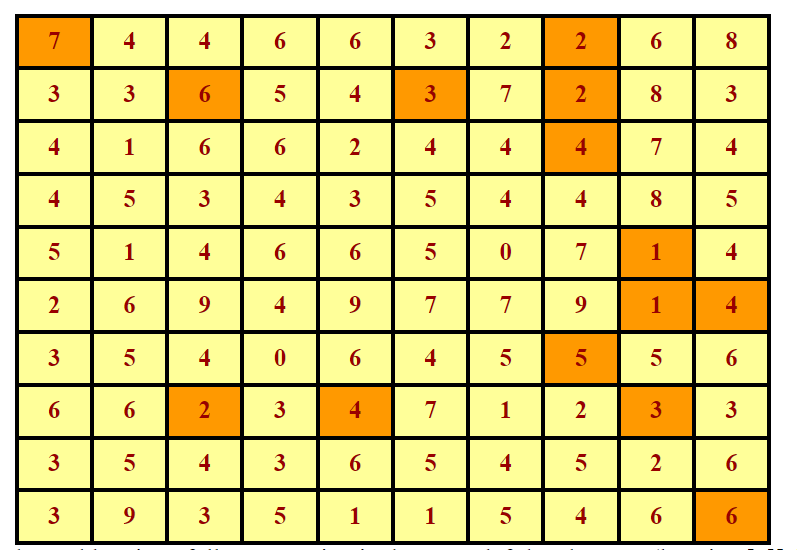

# Path finding puzzles
>
> Level 3

Write a program to read in and solve path-finding puzzles. Each puzzle consists of an NxN array of integers, like this:



The problem is as follows: Starting in the upper left-hand corner (location `[0][0]`), find a sequence of moves that takes you to the bottom right-hand corner (for an NxN array, this would be location `[N-1][N-1]`).
From each location in the array you may move left, right, up, or down; the number in the location tells you exactly how far to move.

For example, location `[0][0]` contains a `7`, so from there you must move exactly 7 squares, either to the right or down.
You cannot move up or left, because that would take you outside the array.

To help you see the solution, the squares along the solution path have been colored orange.
From 7 you move right to 2, down to 4, down to 5, up to 5, etc. The complete solution is 
```
[(0, 0), (0, 7), (2, 7), (6, 7), (1, 7), (1, 5), (1, 2),
 (7, 2), (7, 4), (7, 8), (4, 8), (5, 8), (5, 9), (9, 9)].
```
(Also, in the example, there are several squares from which you cannot move at all! Can you find them?)

## Input

The first line contains `t`, the number of test cases followed by a blank space.
Each of the `t` tests start with a number `n` (`n <= 20`).
Then `n + 1` lines follow.
In the `i-th` line a number `A[i - 1]` is given.
The `(n + 1)-th` line is a blank space.

```
2
10
8 1 8 6 1 2 5 3 7 9
6 0 3 1 3 8 7 0 4 6
7 4 6 2 2 4 3 9 8 3
7 1 4 0 4 2 3 1 6 6
1 9 4 6 2 4 2 2 3 4
9 5 4 2 5 0 4 8 3 3
3 0 4 3 7 7 5 4 4 4
5 6 8 9 3 7 1 2 9 0
4 0 3 1 0 5 0 5 6 6
9 7 6 5 5 5 3 9 2 2
10
6 4 4 4 1 8 1 5 2 9
0 5 7 2 8 8 0 3 3 5
9 7 8 0 7 2 3 9 5 6
6 6 2 4 6 4 1 3 2 1
4 4 2 0 5 9 7 7 3 3
9 2 7 2 9 1 7 6 0 9
6 3 5 0 8 2 4 2 0 7
5 3 1 5 4 9 3 0 6 7
0 4 2 6 9 8 1 3 6 3
3 2 3 0 0 3 8 1 8 5
```

## Output

If you can reach the destination, print `YES`, otherwise print `NO`.

```
YES
YES
```