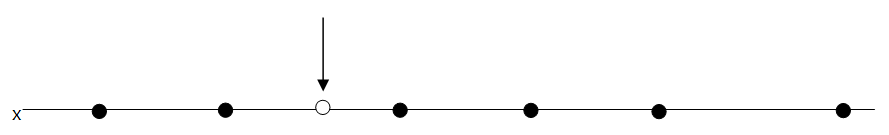
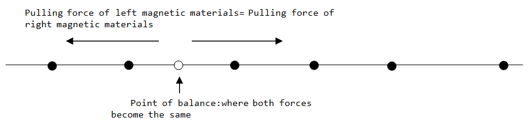

# Point of Balance 2
> Level 4
	
There exist `n` magnetic materials in a gravity-free space.
The center of each magnetic material is the location, i.e., the spatial coordinate `(x,y,z)`.
Coordinates `y` and `z` of n magnetic materials are the same, and only the coordinates of x are different.
In other words, it is assumed the magnetic materials exist in a straight line.
The location of the magnetic materials is never changed by any external force.
Now, when an object is located in a random position in the straight in which `n` magnetic materials exist, gravitational force acts from each magnetic material.
The gravitational force acting from a magnetic material on the object is obtained by the distance `d` between the magnetic material and the object and by the masses of the magnetic material and the object.

Formula for calculating the gravitational force acting from a magnetic material on the object:

$$F = \frac{G \times m_1 \times m_2} { d^2 },$$

$$G$$ is a positive constant.



Between the magnetic materials on the left and those on the right, the object moves in the direction of magnetic materials with bigger force. It is when that the two gravitational forces become the same, the object stops moving. Find the point where both forces become the same. When there are n magnetic materials, n-1 points of balance exist.



Point of balance: where both forces become the same: Pulling force of left magnetic materials = Pulling force of right magnetic materials.

Note that errors of the coordinate values must be less than $$10^{-9}(1e-9)$$.

## Input
A total of 10 test cases are given. For each test case, the number of magnetic materials N is written. In the next line, N x coordinate values, and N mass values are input sequentially. The number (N) of magnetic materials comes between 2 and 10 (2 ≤ N ≤ 10).

```
2           <-- test case #1 starts, number of magnetic materials
1 2 1 1     <-- Each magnetic material’s x coordinate values, and mass values (coordinate coordinate mass mass).
2           <-- test case #2 starts, number of magnetic materials
1 2 1 1000
```


## Output

For each test case, print “#C” in the first line with C being case number. Leave a blank space and print out x coordinate values of the points of balance in the same line. If the coordinate value has 10 or more digits after the decimal point, print only up to10 digits.

```
#1 1.5000000000
#2 1.0306534300
```