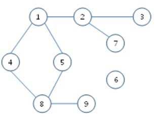
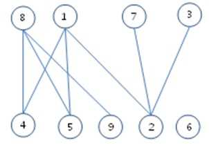

# Bipartitioning Cities
>
> Level 4

You are given a network of roads between N cities.
The following is an example.
Here a vertex means a city and an edge means a bidirectional road between a pair of cities.



You have to partition the cities into two mutually exclusive groups, satisfying the following condition:

There is no road connecting two cities in the same group.

The following is an example partitioning with the above graph.
The cities are partitioned into those in the top level and those in the bottom level.
You can see that there is no road between cities in the same group.
Here, the city 6 can belong to any of the two groups.



When you are given a road network with N cities, generate a program that partitions the cities into two groups satisfying the condition described above. If you can not partition them appropriately, you have to specify it.

## Constraints

The number of cities: `5 <= N <= 1000`

The number of edges: `1 <= E`

## Input

You are given `12` test cases.
A test case has two lines; thus there are `24` lines in total.
In each test case, the first line has `N` (the number of cities) and `E` (the number of roads) separated by a space.
The next line enumerates `E` roads.
A road consists of the two cities it connects.
For example, the road connecting cities `5` and `28` is represented by `5 28` or `28 5`.
The indices of cities are `1` through `N`.
All adjacent numbers in a line are each separated by a space.

```
9 8
4 1 1 2 2 3 7 2 1 5 8 4 5 8 8 9
7 10
1 2 2 3 1 6 4 6 2 4 2 7 2 5 6 7 3 5 5
...
```

## Output

Output the 12 answers in 12 lines.
Each line starts with `#x`, where `x` means the index of a test case, and puts a space, and prints the answer.
The answer enumerates only one of the two groups.
The answer starts with `K`, the number of cities in the group, and then enumerates the `K` cities.
If it is not possible to properly partition, print `–1`.
If there is more than one appropriate partitioning, answer just one of them.
All numbers in a line are each separated by a space.

```
#1 4 8 1 7 3
#2 -1
...
```
