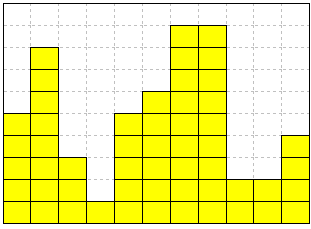
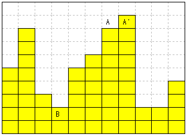
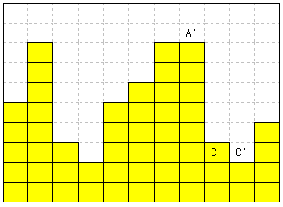

# Flatten
>
> Level 3

Yellow boxes are stacked against a wall. Flattening is a task of reducing the gap between the tallest column and shortest column by moving the boxes on the taller column to the shorter column. After the flattening is completed, the height difference between the tallest column and shortest column should be no more than one box.

Create a program returning the height difference between the tallest column and shortest column after moving the boxes for flattening for the given number of times when there is a limit on the number of tasks of moving the boxes.



The task of moving a box from the tallest column to the shortest column is defined as `dump`.
The diagram below shows the result of performing one dump from the diagram above.



A box in the column A was moved to the column B. It is acceptable to move the box in the column A' instead of the column A.

The diagram below shows the result of two dumps.



A box in the column A’ was moved to the column C. It is acceptable to move the box to the column C’ instead of the column C.

After two dumps, the height difference between the tallest column and shortest column is 8 -2 = 6. (It was 9 -1 = 8 before the first dump.)

If the number of dumps is limited to 2, the program should return 6.


## Constraints

The width length is always 100.

All columns have the height of 1 ~ 100.

The dump count can be 1 ~ 1000.

No more dumps can be executed if flattening is completed within the given dump count. Therefore, the height difference between the tallest column and shortest column should be returned. (It can be 0 or 1 depending on the data.)

## Input

The first line of the input file provides the number of dumps.
The test case is given in next lines.

Total of 11 test cases are given.

```
2
5 8 3 1 5 6 9 9 2 2 4
834
42 68 35 1 70 25 79 59 63 65 6 46 82 28 62 92 96 43 28 37 92 5 3 54 93 83 22 17 19 96...
617
16 40 59 5 31 78 7 74 87 22 46 25 73 71 30 78 74 98 13 87 91 62 37 56 68 56 75 32 53...
...
```

## Output

The output file outputs the test case number following the `#`` symbol.
It is followed by a space, and then the height difference between the tallest column and shortest column in the test case is output.

```
#1 6
#2 13
#3 32
...
```