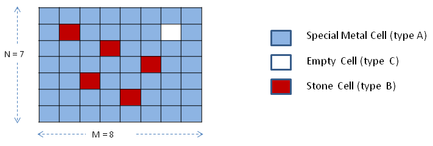

# Grid Acid
>
> Level 4

A rectangular grid has `N x M` size. 
Each cell is either made of a special metal(`type A`) or made of stone (`type B`).

If acid is poured on a cell of grid, it can either melt it and spread further(`type A`) or do not pass through it(`type B`).

The cell made with special metal (`type A`) can melt with acid in `1 second` and thus allow acid to spread further.

The cell made with stone (`type B`) does not react with acid and hence neither melt nor allow acid to pass through it.

There is a third type of a cell that is empty (`type C`), but has a boundary (all 4 sides) covered with a protective metal.
If all 4 sides of it come into contact with acid at any given time, then it's boundary melt down and allow acid to pass through it.
In that case, it get filled with acid.

There is one and only one such cell in a given grid.



```
             8
      <------------->
      1 2 3 4 5 6 7 8
 ^ 1 |1|1|1|1|1|1|1|1|      0: type B (stone)
 | 2 |1|0|1|1|1|1|2|1|      1: type A (metal)
 | 3 |1|1|1|0|1|1|1|1|      2: type C (empty)
7| 4 |1|1|1|1|1|0|1|1|
 | 5 |1|1|0|1|1|1|1|1|
 | 6 |1|1|1|1|0|1|1|1|
 v 7 |1|1|1|1|1|1|1|1|
```

Acid is poured on one of the cell of grid, the cell being made of special metal that can melt with acid.

It is guaranteed that acid will be poured on only one cell made up of special metal (`type A`), not on the stone (`type B`) nor the empty cell(`type C`).

Acid is poured continuously until all the grid cells (except stone - `type B`) melt completely.

You have to tell when the empty cell with special protective boundary will get filled with acid and when whole grid will get filled with acid (except the cells made up of stones).

It takes `1 sec` for acid to dissolve special metal cell and after that it can spread to its 4 orthogonal neighbors (Left, Right, Up, Down).

## Input

First entry is number of test cases `T`, the rest is each test case input.

For each test case first row contains `N` and `M` as two integers separated by a space.

Next row contains the location of cell (row and column number separated by space) where acid will be poured continuously until whole grid (except stone cells) melt. **1-based index**

Next `N` rows contain `M` integer values each containing the cell type.

Cell type value is of 3 types:
- 0 : cell is stone (type B)
- 1:  cell is made special metal (type A)
- 2:  cell is special empty cell, having a special boundary (type C)

**Note:  There is always one and only one cell of type C (value 2) in a given grid.**

```
10              ---> T: Number of test cases.
4 5             ---> 1nd test case starts, N=4, M=5
2 4             ---> Location of cell(row, col) where acid is poured
1 0 1 0 1       ---> Grid's 1st row with M cell entries
1 0 1 1 1       ---> Acid is  poured on 4th cell of this (2nd) row
1 1 2 1 1       ---> Rows contains empty cell (type C, value 2)
1 0 1 0 1       ---> Last row of the grid with cell M values
3 3             ---> 2nd test case starts, N=3, M=3
1 2             ---> Location of cell(row, col) where acid is poured
1 1 0           ---> Grid's 1st row with M cell entries; Acid poured on 2nd cell of this (1st) row
1 2 1
0 1 1
3 3
1 1
1 1 1
1 2 1
0 1 1
3 3
3 3
1 1 1
1 2 1
0 1 1
4 4
2 3
0 0 1 0
0 1 1 1
1 1 2 1
1 0 1 1
3 3
1 3
0 1 1
1 2 1
1 1 1
4 5
1 3
1 0 1 0 1
1 0 1 1 1
1 1 1 2 1
1 0 0 1 1
4 5
3 5
1 0 1 0 1
1 0 1 1 1
1 1 1 2 1
1 0 0 1 1
4 5
2 4
1 0 1 0 1
1 1 1 1 1
1 1 2 1 1
1 0 1 1 1
7 8
3 3
1 1 1 1 1 1 1 1
1 0 1 1 1 1 2 1
1 1 1 0 1 1 1 1
1 1 1 1 1 0 1 1
1 1 0 1 1 1 1 1
1 1 1 1 0 1 1 1
1 1 1 1 1 1 1 1
```

## Output

Output should contain 2 lines for each test case.

1st line:   Case#

2nd line:   Count1  Count2

Where:

Count1:  time in seconds when special empty cell (type C) will get filled.

Count2:  time in seconds when whole grid will get filled with axis (note: stone cell cannot be filled with acid).

**Note:**

1. Count2 will be -1 if all cells of the grid (except stone cells) cannot be dissolved.
   Whole grid dissolving term means that all cells except stone get filled with Acid.
2. Count1 will be -1 if empty cell cannot be filled.
   If empty cell cannot be filled the #1 is also applicable, i.e. then Count2 = -1.
3. Once acid enters special cell, it accumulates there for 1 second.
   After that the acid starts leaking to neighboring (left, right, up, down) cells.
4. The terms "dissolve", "melt", "leaking" are used to express similar meaning that the cell starts leaking the acid to its neighbor cells (left, right, up, down).
5. Acid is poured continuously so once a cell starts leaking acid, it may spread further to other cells in further course of time.
6. The maximum number of rows or columns of grid is `3000`.

```
Case #1
-1 -1
Case #2
-1 -1
Case #3
6 6
Case #4
6 6
Case #5
5 5
Case #6
6 6
Case #7
7 7
Case #8
5 9
Case #9
4 6
Case #10
9 10
```

## Explanation

For Case #3:
```
3 3
1 1
1 1 1	
1 2 1
0 1 1
```
```
|A|A|A|     |1|A|A|     |1|2|A|     |1|2|3|     |1|2|3|     |1|2|3|     |1|2|3|
|A|C|A|     |A|C|A|     |2|C|A|     |2|C|A|     |2|C|4|     |2|C|4|     |2|6|4|
|B|A|A|     |B|A|A|     |B|A|A|     |B|A|A|     |B|A|A|     |B|A|5|     |B|6|5|
   0           1           2           3           4           5           6
```
