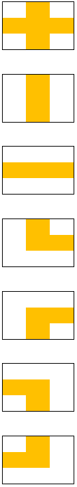
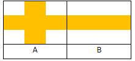
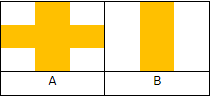
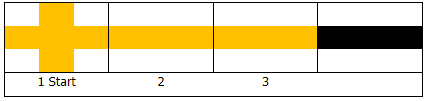
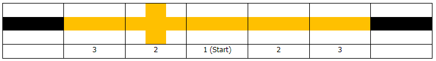

# Hugo bán dầu
>
> Level 4

Hugo được giao bán dầu trên một mạng lưới đường ống dẫn dầu, mỗi một vị trí sẽ thiết lập một loại đường ống khác nhau dựa vào địa hình. Sau khi đi khảo sát, Hugo biết rằng mạng lưới đường ống được tạo thành từ 7 loại ống như bên dưới.

1. Dầu có thể đi từ trái sang phải từ trên xuống dưới và ngược lại.
2. Dầu có thể đi từ trên xuống dưới và ngược lại
3. Dầu có thể đi từ trái sang phải và ngược lại
4. Dầu có thể đi từ trên sang phải và ngược lại
5. Dầu có thể đi từ dưới sang phải và ngược lại
6. Dầu có thể đi từ dưới sang trái và ngược lại
7. Dầu có thể đi từ trên sang trái và ngược lại



Chỉ các đường ống có kết nối mới cho phép dầu đi qua.
Hai đường ống được gọi là có kết nối nếu chúng có chung điểm cuối.

## Ví dụ

Trường hợp A có thể đi sang B.



Nhưng trong trường hợp này, A không thể đi sang B vì A không có điểm cuối nào trùng với điểm cuối của B.



Tuy nhiên, để bán dầu, Hugo cần phải bơm dầu vào đường ống.
Sức người có hạn, Hugo chỉ có thể bơm dầu trong một khoảng thời gian nhất định, mỗi một giờ dầu mới chảy được hết một đường ống.
Ví dụ: Hugo có thể bơm dầu trong 3 giờ, điều đó có nghĩa là từ vị trí bơm dầu, dầu chỉ có thể chảy đến tối đa xa nhất cách đó 3 ô.
Dầu có thể chảy theo bất kỳ hướng nào miễn là có kết nối



Đưa ra một ma trận mạng lưới đường ống và vị trí bơm dầu của Hugo, giới hạn thể lực của Hugo, hãy tính toán và in ra tổng số đường ống mà dầu đã chảy qua.



## Constraints

Hugo luôn được đặt tại ô có đường ống dẫn dầu

## Input

- Số trường hợp thử nghiệm `T` (`T <= 50`)
- Mỗi trường hợp thử nghiệp dòng đầu tiên chứa :
  - kích thước ma trận `N x M` (`5 <= N, M <= 50`)
  - vị trí Hugo (chỉ số bắt đầu từ 0)
  - thể lực của Hugo `P` (`1 <= P <= 20`)
- Chi tiết của ma trận được cho trong `N` hàng tiếp theo.
  Giá trị `C` trong mỗi ô là giá trị đại diện cho loại đường ống, tổng số 7 loại, `0 <= C <= 7`, giá trị 0 nghĩa là không có đường ống.

```
3
5 6 2 1 3
0 0 5 3 6 0
0 0 2 0 2 0
3 3 1 3 7 0
0 0 0 0 0 0
0 0 0 0 0 0
5 6 2 2 6
3 0 0 0 0 3
2 0 0 0 0 6
1 3 1 1 3 1
2 0 2 0 0 2
0 0 4 3 1 1
10 10 4 3 9
0 0 0 0 0 0 0 0 0 0
0 0 0 7 5 0 5 0 0 0
0 0 3 2 2 6 0 0 0 0
0 4 7 2 2 2 7 0 0 4
0 3 0 1 1 2 2 0 0 5
0 5 6 1 1 1 1 6 2 5
7 4 1 2 0 0 4 6 0 0
5 3 1 7 0 2 2 6 5 7
7 3 2 1 1 7 1 0 2 7
3 4 0 0 4 0 5 1 0 1
```

## Output

The total number of pipes that fuel can flow to

```
Case #1
5
Case #2
15
Case #3
29
```
