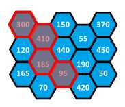
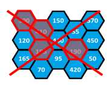
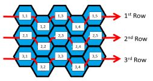

# Hugo và Chị Ong Nâu
>
> Level 4

Hugo và chị ong nâu là hàng xóm của nhau. Tuy nhiên Hugo thì lười nhưng lại muốn lấy mật ăn, còn chị ong nâu thì chăm chỉ kiếm mật để đầy tổ của mình. Vì thèm ăn mật ong mà mãi chị ong nâu không cho nên sau 1 thời gian nằm gai nếm mật rình mò Hugo đã phát hiện ra các bố trí của các thùng chứa mật và số mật trong mỗi thùng ở nhà chị ong nâu. Mật ở nhà chị ong nâu được biểu diễn bằng 1 ma trận NxM ô, mỗi ô một thùng mật. Mỗi ô chứa lượng mật nhất định và có thể liên kết với 6 ô xung quanh theo cách bố trí của tổ ong. 2 ô được gọi là có liên kết nếu chúng có chung cạnh.

Hôm nay Hugo phát hiện chị ong nâu đi sang khu rừng bên cạnh để lấy mật. Hugo sẽ vào nhà chị ong nâu để ăn trộm mật ong của chị. Để không bị phát hiện Hugo chỉ có thể lấy tối đa 4 thùng ở 4 ô có liên kết với nhau. Hãy giúp Hugo tìm ra bình phương tổng lượng mật lớn nhất có thể lấy.

## Example

$M = 5$, $N = 3$



Trong ví dụ trên, bình phương tổng lượng mật là

$$(300 + 410 + 185 + 95)2 = 980100$$



Trong ví dụ trên Hugo sẽ bị phát hiện và không thể lấy mật.

## Input

- Dòng đầu tiên là số thử nghiệm `T` (`T <= 50`)
- Mỗi TC :
    - Dòng đầu tiên chưa kích thước ma trận `M`, `N` (`3 <= N, M <= 15`)
    - Trong `N` dòng tiếp theo, lượng mật `C` ở mỗi ô sẽ được cho theo quy tắc bên dưới (`0 <= C <= 1000`)



```
5
5 3
300 410 150 55 370
120 185 440 190 450
165 70 95 420 50
5 5
356 55 41 453 12
401 506 274 506 379
360 281 421 311 489
425 74 276 371 164
138 528 461 477 470
```

# Output

Ghi ra bình phương tổng lượng mật

```
Case #1
2250000
Case #2
3748096
Case #3
3928324
Case #4
7236100
Case #5
13104400
```


