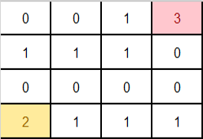

# Mario Climb
>
> Level 4

Mario cần phải di chuyển từ vị trí có giá trị bằng 2 và ăn vàng ở ô có giá trị bằng 3.



- 0 là những ô Mario không thể qua
- 1 là những ô Mario có thể qua
- 2 là vị trícủa Mario
- 3 là vị trí Mario cần di chuyển đến

Các vị trí này được thể hiện bằng ma trận `NxM` (`2 <= N, M <= 50`)

Mario có thể di chuyển theo hàng ngang hoặc hàng dọc

Hàng ngang mario chỉ nhảy được tối đa 1 bước

Hàng dọc mario có thể nhảy được `h` bước

Tìm bước nhảy `h` tối thiểu để Mario có thể ăn được vàng

## Input

```
3
5 8
1 1 1 1 0 0 0 0
0 0 0 3 0 1 1 1
1 1 1 0 0 1 0 0
0 0 0 0 0 0 1 0
2 1 1 1 1 1 1 1
5 6
0 1 1 1 0 0
3 1 0 1 1 0
0 0 0 0 1 1
0 0 0 0 0 1
2 1 1 1 1 1
9 13
0 1 1 1 1 1 1 1 1 1 1 1 1
1 1 0 0 0 0 0 0 0 0 0 1 1
0 0 0 0 0 0 0 0 0 0 0 0 0
0 0 0 0 0 0 0 0 0 0 0 0 0
1 1 0 0 0 0 0 0 0 0 0 1 3
0 0 0 0 0 0 0 0 0 0 0 0 0
1 1 0 0 0 0 0 0 0 0 0 0 0
0 0 0 0 0 0 0 0 0 0 0 0 0
2 1 1 1 1 1 1 1 1 1 1 1 1
```

## Output

```
Case #1
2
Case #2
1
Case #3
3
```