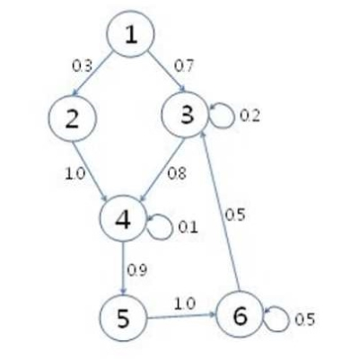
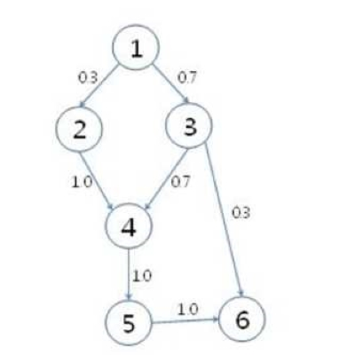

# Visit Department
>
> Level 4

Jang keeps visiting and helping a number of departments right after he comes to work.

There is a rule in his movement.
He stays at a department (dept) exactly for 10 minutes.

You are given a probability graph of their movements.
Fig. 1 is an example graph.



Jang stays at dept. 1 for 10 minutes; then he moves to dept. 2 with a probability of 0.3 (then stays there for 10 minutes) or moves to dept. 3 with a probability of 0.7 (then stays there for 10 minutes).
We do not consider the time for moving between departments.

There may be more than one outgoing arrow from a department; the sum of the chances of outgoing arrows from a department should be always 1.

The first department which he visit is always dept. 1.

Given a probability graph and a time T(in minutes), generate a program that finds the department at which Jang stays with the highest chance at time T.

In addition you have to report the corresponding probability.

In the Fig. 1, the department with the highest chance at time 10 is dept. 3 and the chance is 0.7.
At time 9, Jang does not start moving; so he is at dept. 1 with a probability of 1.

Look at the situation at time 20.
The chance of being at dept. 1 or dept. 2 is 0.
He leaves dept. 1 exactly at time 10, and if he moves to dept. 2 then he leaves dept. 2 exactly at time 20.

The chance of being at dept. 4 at time 20 is $0.3*1.0+0.7*0.7=0.79$.

When he arrives at a department without any outgoing arrow, the department becomes the last one that he finally visits;
he stays at the department for 10 minutes and leaves work.



With the graph of Fig. 2, Jang is not in work at time 50; in case of Fig. 1, he may stay at work forever if he keeps staying at the same department with a loop probability, e.g, departments 3, 4, or 6

In addition, there is another person, Kang, who moves in the same way as  Jang.

Jang always comes to work at time 0, but Kang comes at another time later than time 0.
You also have to report the same type of contents for Kang.

If Kang's arrival time is 4, answers related to him is computed exactly the same principle as  Jang�s except he starts working 4 minutes later than Jang; in this case with Fig. 2, Kang stays at dept. 1 from time 4 to time 13 while Jang stays at dept. 1 from time 0 to time 9.

## Input

`10` test cases are given.
Each case is given in `2` lines.
Thus the input needs totally `20` lines.

For each case, the first line provides `N` (the number of departments), `E` (the number of arrows), `K` (Kang's arrival time), and `T` (the time in minutes).

```
1<=N<=100,   1<=E<=200,   1<=K<=1000,     0<=T<=1000,     K<=T.
```

The next line enumerates `E` arrows.
Each arrow is denoted by `source-dept destination-dept` probability.
The index for source dept. or destination dept. is an integer in 1 through 100, inclusive.

The time integer `K` and `T` are in minutes.
For example, if the time T is 8, you have to determine the departments at which Jang and Kang, respectively, stay with the highest probabilities at time 8.
The elements in the same line are separated by a space.
There is no special order in which the arrows are enumerated.

```
6 7 100 100
1 2 0.3 1 3 0.7 2 4 1.0 3 4 0.7 3 6 0.3 4 5 1.0 5 6 1.0
6 7 1 23
1 2 0.3 1 3 0.7 2 4 1.0 3 4 0.7 3 6 0.3 4 5 1.0 5 6 1.0
6 10 8 40
1 2 0.3 1 3 0.7 3 3 0.2 3 4 0.8 2 4 1 4 5 0.9 4 4 0.1 5 6 1.0 6 3 0.5 6 6 0.5
6 10 10 10
1 2 0.3 1 3 0.7 3 3 0.2 3 4 0.8 2 4 1 4 5 0.9 4 4 0.1 5 6 1.0 6 3 0.5 6 6 0.5
6 10 9 20
1 2 0.3 1 3 0.7 3 3 0.2 3 4 0.8 2 4 1 4 5 0.9 4 4 0.1 5 6 1.0 6 3 0.5 6 6 0.5
```

## Output

You write the 10 answers in 10 lines.

Each line starts with `#x` (Here, x means the case index.), puts a space, and writes the answer.

The answer consists of the department index with the highest chance followed by the corresponding probability. The dept. index is an integer and the probability is a real number, separated by a space.

If there is more than one department with the highest chance, you write the dept. of the lowest index.

If  Jang is not at any department at the specified time, you write just `0 0.000000`.
The probability is a real number in 0 through 1, inclusive; it should be accurate to six decimal places.

Another set of a department and the corresponding probability has to be provided for Kang.
Thus the answer consists of four numbers in total.

```
#1 0 0.000000 1 1.000000
#2 4 0.790000 4 0.790000
#3 6 0.774000 5 0.774000
#4 3 0.700000 1 1.000000
#5 4 0.860000 3 0.700000
```