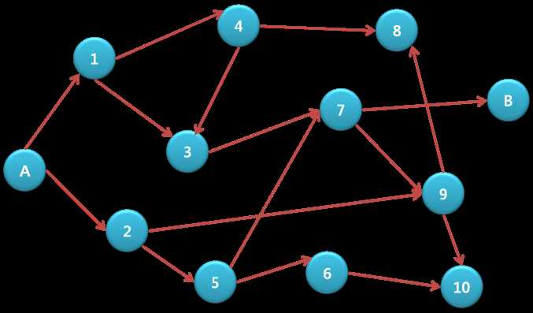

# Route Finding
>
> Level 3

The problem is to investigate whether there is a route from point A to point B depicted in a map as the figure shows.
There can be up to two crossroads.
All roads are one way and cannot be returned.



Create a program to determine if there is a route from point A to point B when the roads are given.
- Points A and B are fixed with numbers 0 and 99, respectively.
- All roads are expressed in a number pair. In the example above, the roads starting from number 2 can be expressed in (2, 5) and (2, 9).
- The route exists if there is at least one route.
- One cannot go against the arrow direction.

## Constraints

The starting point and destination point are represented by 0 and 99, respectively.

The number of peaks (crossroad points) cannot exceed 98 (excluding the starting and destination points), and the number of roads to choose from a peak cannot exceed 2.

The following guideline is just a suggestion and not mandatory.

## Data Storage Guide

Since the maximum number of peaks (crossroads) is 100, declare a static array of size[100], and use the number of each peak as the address. Save the number of arriving peak from each peak.

The result from the above example is shown below.

|0|1|2|3|4|5|6|7|8|9|10|99|
|-|-|-|-|-|-|-|-|-|-|-|-|
|1|3|5|7|8|6|10|9||8|||

|0|1|2|3|4|5|6|7|8|9|10|99|
|-|-|-|-|-|-|-|-|-|-|-|-|
|2|4|9|||7||99||10|||

## Input

The first line of the input file provides the test case number and the total number of roads.
The next line contains the sequence pairs.

The sequence pairs are not separately displayed.
They are paired in the listed sequence.

```
1 16
0 1 0 2 1 4 1 3 4 8 4 3 2 9 2 5 5 6 5 7 7 99 7 9 9 8 9 10 6 10 3 7
2 159
0 4 0 10 1 4 1 10 2 11 2 8 3 13 4 8 4 11 5 10 5 8 6 10 6 11 7 8 7 15 8 14 9 10 9 20 10 14 10 17 11 21 12 21 13 14 13 17 14 20 15 22 16 22 16 20 17 19 18 28 18 29 19 27 20 29 21 31 21 30 22 24 22 30 23 24 23 26 24 27 25 31 26 31 26 37 27 34 27 30 28 38 28 30 29 32 30 38 30 32 31 35 31 36 32 34 32 37 33 40 33 44 34 44 35 39 35 46 36 38 36 41 37 40 38 40 38 49 39 41 39 44 40 45 41 44 41 50 42 44 42 51 43 45 43 52 44 45 44 52 45 48 45 52 46 47 46 55 47 48 47 58 48 53 49 55 50 59 50 60 51 57 51 60 52 60 52 63 53 57 53 62 54 62 54 65 55 62 56 58 57 66 58 64 58 61 59 69 60 62 61 63 62 68 62 64 63 66 64 68 64 71 65 75 65 67 66 75 66 73 67 71 67 72 68 72 68 70 69 72 70 71 70 80 71 80 72 81 72 83 73 77 73 75 74 83 74 78 75 81 75 85 76 79 76 82 77 86 77 87 78 86 78 81 79 89 80 84 80 86 81 83 81 88 82 87 82 86 83 86 83 94 84 94 84 88 85 95 86 91 86 97 87 93 88 92 88 90 89 97 89 92 90 99 91 95 92 96 92 97 94 95 95 97 95 99 96 97
........
........
```

## Output

Output the answer to each test case.
Each line begins with `#x` followed by a space and then the next answer.
Output `1` if the route exists and `0` if not.

Here, `x` is the test case number.

```
#1 1
#2 1
....... 
....... 
```
