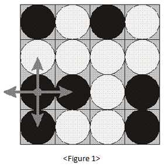

# Turn Over Game
> Level 4

As in , there is a `4×4` sized table.
In a grid of the table, there are white or black stones.
When you choose a position of stone randomly, the stone and four stones adjacent to the up, down, left and right sides of the stone will turn to the opposite color like turning a white stone to a black & a black stone to a white. Let’s suppose this process as a calculation.



Using such a calculation, you want to change all the stones on the table into all whites or all blacks.
Find out the minimum operation count at this time.

Time limit: `1 second` (java: `2 seconds`)

## Input

Several test cases can be included in the inputs.
`T`, the number of cases is given in the first row of the inputs.
After that, the test cases as many as `T` (`T <= 30`) are given in a row.
Table info is given without blank over four rows per each test case.
Colors are indicated like white for `w` and black for `b`.

```
2
bwwb
bbwb
bwwb
bwww
bwbw
wwww
bbwb
bwwb
```

## Output

Output the minimum operation count to change all colors as white or black on the first row per each test case.
If not possible, output `impossible`.

```
Case #1 
4 
Case #2
impossible
```
