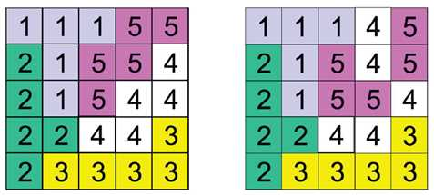

# Uniform Distribution in Square
>
> Level 3

An uniform distribution of an `n x n` square array of cells is a partition of the $$n*n$$ cells in the array inexactly $$n$$ sets, each one with $$n$$ contiguous cells.
Two cells are contiguous when they have a common side.

A good uniform distribution is composed of contiguous regions. The figures show a good and a wrong uniform distribution for a 5 x 5 square:



Note that in the second example the cells labeled with 4 describe three non-contiguous regions and cells labeled with 5 describe two non-contiguous regions.
You must write a program that evaluates if an uniform distribution of the cells in a square array is good or not. 

## Input

The first line contains the number of test cases.
Test cases follow in next lines.

It is understood that a cell in an `n x n` square array is denoted by a pair `(i, j)`, with `1 <= i`, `j <= n`.
The input file contains several test cases.
Each test case begins with a line indicating `n`, `0 < n < 100`, the side of the square array to be partitioned. 
Next, there are `n - 1` lines, each one corresponding to one partition of the cells of the square, with some non-negative integer numbers.
Consecutive integers in a line are separated with a single blank character.
A line of the form 
```
a1 a2 a3 a4 ...
``` 
means that cells denoted with the pairs `(a1,a2)`, `(a3, a4)`,.. belong to one of the areas in the partition.

The last area in the partition is defined by those cells not mentioned in the `n - 1` given lines.

```
3
2
1 2 2 1
5
1 1 1 2 1 3 3 2 2 2
2 1 4 2 4 1 5 1 3 1
4 5 5 2 5 3 5 5 5 4
2 5 3 4 3 5 4 3 4 4
5
1 1 1 2 1 3 3 2 2 2
2 1 3 1 4 1 5 1 4 2
4 5 5 2 5 3 5 5 5 4
2 4 1 4 3 5 4 3 4 4
```

## Output

For each test case `good` must be printed if the uniform distribution is good, in other case, `wrong` must be printed.
The answers for the different cases must preserve the order of the input.
The first output line for each test case should be `Case #tn`, where `tn` is the test case number.

```
Case #1
wrong
Case #2
good
Case #3
wrong
```