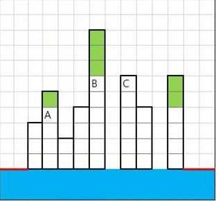

# View
>
> Level 2

Apartment buildings are densely packed along a riverside.
Although the view of the river is very good from all households as they are so closely crammed with each other, it is often the case that the residents can only see the wall of the next building through the a right or left window.
It is said that the sufficient viewing area can be obtained when there is a minimum distance of 2 blocks of open space between the buildings.
The program should return the number of households having the sufficient viewing area in both sides when the information on buildings is given.

When there are 8 buildings on a riverside as shown below, 6 households colored green have the sufficient viewing areas since there are at least two blocks of open space to the right and left.
Therefore, the program should return 6.



Households A and B have the sufficient left viewing area since there are more than 2 blocks of open space but the right viewing area is not sufficient because there is only one block of open space. The household C has the 2 blocks of open space to the right but only 1 block to the left.

## Constraints

The width length is always 1000 or less.

There is no building on two leftmost blocks and two rightmost blocks (blocks marked red in the example).

## Input

The first line of the input file provides the length of the test case.
The test case is given in next lines.

Total of 10 test cases are given.

```
100
0 0 225 214 82 73 241 233 179 219 135 62 36 13 6 71 179 77 67 139 31 90 9 37...
1000
0 0 225 214 82 73 241 233 179 219 135 62 36 13 6 71 179 77 67 139 31 90 9 37...
...
```

## Output

The output file outputs the test case number following the `#` symbol.
It is followed by a space, and then the number of households having the sufficient viewing areas to the right and left in the test case is output.

```
#1 691
#2 9092
```

